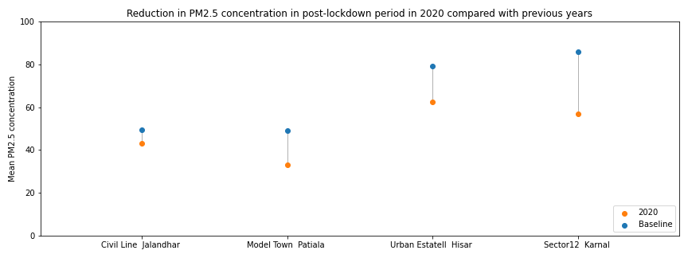

# Impact of fires on air quality in northern India
## Using this repo
1. Run `git clone https://github.com/vidurmithal/BSA.git`.
2. Install dependencies by running `pip install -r requirements.txt`. Note that this is likely to run into trouble due to compatibility issues between geospatial packages, particularly `fiona` and `gdal`. Read more [here](https://geopandas.org/getting_started/install.html#installing-with-pip). A better option would be to create a new `conda` environment with the required packages by running `conda create --name <env> --file requirements2.txt`.
3. Run notebook `fires-aq-covid.ipynb`. 

## Background
22 of the 30 most polluted cities in the world (based on PM2.5 concentrations) are in India, and all 22 of these lie in the northern Indian states of Delhi, Uttar Pradesh or Haryana ([IQ Air 2020](https://www.iqair.com/world-most-polluted-cities)). Significant contributions to this poor air quality are attributed to burning of biomass, including crop residue and household fuels - upto 20 per cent of PM2.5 in Delhi in 2019 was contributed by this source, according to [UrbanEmissions.com](https://urbanemissions.info/blog-pieces/whats-polluting-delhis-air/). Nearby states, particularly Haryana and Punjab, also contribute to the poor air quality in the region due to the practice of burning of crop residue that is prevelant in these states.

The aim of this repository is to investigate the impact of the Covid-19 pandemic and the societal responses it triggered on the air quality of the northern India region, focussing on the air pollution caused by biomass  burning in Punjab and Haryana. 

We consider the area bounded by the box (73.809761 E, 28.644667 N, 81.019043 E, 32.562569 N). The years 2018 and 2019 are used to establish 'baseline' conditions in terms of air quality and fire incidences, and these are compared with 2020 when Covid-19 and the lockdowns took effect. 

The primary focus is on fire incidence data, which is obtained from NASA's VIIRS instrument aboard the NOAA/SUOMI satellite. This instrument detects fires at a spatial resolution of 375m, and also measures fire radiative power and brightness. By correlating the number of fires around selected air quality monitoring stations, we attempt to determine the impact of these fires on air quality. 

We also consider meteorological data from the ERA5 reanalysis in order to develop a more robust model correlating fires with air quality. 

# Results
### Covid-induced lockdown had a short-term impact on air quality

### Satellites detected significantly fewer fires in the summer of 2020 compared to 2019

### Post-lockdown months saw a significant reduction in PM2.5 concentrations compared to baseline values

